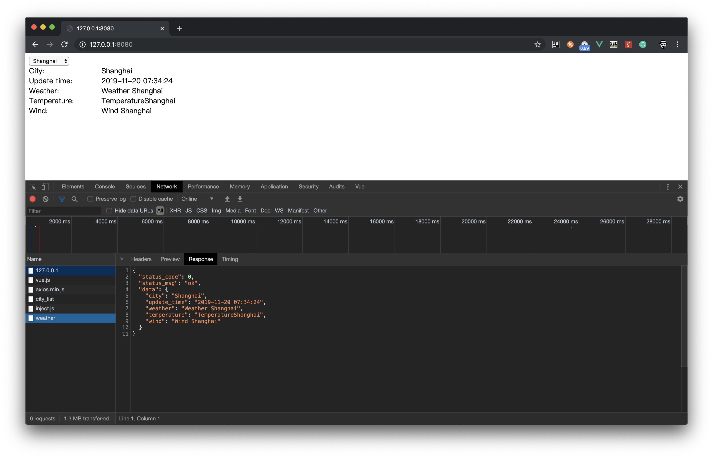

# weather

I use a open source framework beego to build this project, so we need get it first,
run the command below to get it. I didn't use go mod here.

    go get github.com/astaxie/beego
    
then go to the project folder, build and run it.

    cd ~/go/src/weather
    go build -o weather
    ./weather
    
**screenshots**
