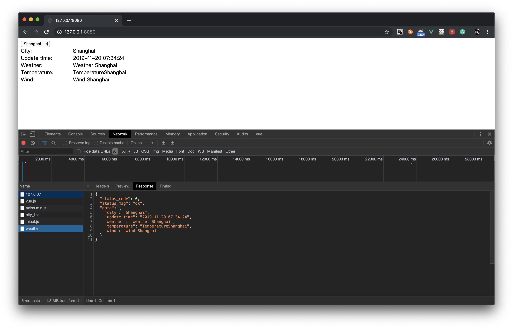

# weather

I use a open source framework beego to build this project, so we need get it first,
run the command below to get it. I didn't use go mod here.

    go get github.com/astaxie/beego
    
then go to the project folder, build and run it.

    cd ~/go/src/weather
    go build -o weather
    ./weather
    
**screenshots**

*finally*

I moved the city data into a city.json file. you need modify the json file path from
the conf/app.conf to your own path.

I can't connect any weather api, so i make a fake one.

## deploy

When I push code to github, the Webhooks will push a message to my server.
On my server, a nodejs app hosted, it will pull && build source code from github 
when received a message pushed from github.

